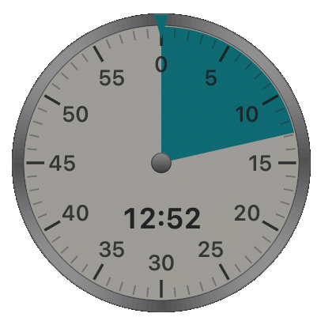

# Kitchen Timer



An analogue kitchen timer as a floating overlay on macOS. A borderless round
window sits at `.statusBar` level with `canJoinAllSpaces`, so it stays visible
across every Space and above full-screen apps. The panel is a
`.nonactivatingPanel` — clicking the dial does not steal focus from whatever
is underneath.

## Features

- **Analogue 60-minute dial.** Wind it up by dragging across the face, the way
  a mechanical timer works; the countdown starts when you let go.
- **Floating overlay.** Stays visible across every Space and above full-screen
  apps, and clicking it does not steal focus from what is underneath.
- **Presets** from 1 to 60 minutes in the context menu, for when dragging is
  overkill.
- **Four sizes** (140–340 px) and **five colours**.
- **Transparency** in five steps, for when the timer should stay in view
  without taking over the screen.
- **Light or dark face.**
- **Snapping to whole minutes**, with ⌥ for a finer step.
- **Sound:** a recording of a real kitchen timer, the macOS system sounds, or
  any audio file of your own.
- **English and Czech**, switchable from the menu without touching system
  settings.
- **A system-wide shortcut** (⌃⌥⌘M) to hide and show it — and no Accessibility
  permission needed for it.
- **Nothing in the Dock or the app switcher**; the dial is the whole interface.
- Position, size, colour, transparency, sound and the last time dialled in are
  all remembered.

## Controls

| Action | What it does |
|---|---|
| drag across the dial | winds up the time; the countdown starts when you let go |
| ⌥ + drag | no snapping to whole minutes |
| **drag the steel bezel or the centre knob** | moves the timer around the screen |
| ⌘ + drag anywhere | the same, when the bezel is hard to hit |
| click | pause / resume (during ringing it stops the alarm) |
| scroll wheel | 15 s per notch |
| right click | menu |
| ⌃⌥⌘M | hide / show (system-wide, no Accessibility permission) |

The menu holds presets (1–60 min), size, colour (Red, Teal, Yellow, Green,
Orange), transparency (0–80 %, 0 = opaque), sound, language, dark face and
snapping to minutes.

Position, size, colour, transparency, sound and the last time dialled in all
survive a restart (`UserDefaults`, domain `eu.zvonicek.kitchentimer`).

## Sound

- **Ring** — the default: `Resources/ring.wav`, a recording of a real kitchen
  timer (1.79 s, peak 0.30, stereo 48 kHz). The untouched original is kept
  alongside it as `Resources/ring-source.m4a`; it runs 4.7 s, with 2 s of
  silence at the front and a fading tail from 3.80 s on that reads as
  clacking, so the shipped file is cut to 2.006–3.800 s with an 8 ms fade in,
  a 70 ms fade out and the peak brought down to 0.30 — roughly the level of
  the system sounds.
- system sounds (Glass, Ping, Submarine, Funk, Hero, Purr)
- **a custom file** through `Sound ▸ Custom file…` (aiff, wav, mp3, m4a…).
  The file is converted to stereo 48 kHz into
  `~/Library/Application Support/KitchenTimer/`; the original is left
  untouched. A reference stored earlier elsewhere is brought across at launch;
  anything unreadable falls back to the built-in bell.

**Everything is stereo on purpose.** A mono track on a multi-channel output
(a monitor over DisplayPort reports 6 channels) can land on a channel the
speakers do not play — the sound looks like it is running and cannot be heard.

The alarm rings once. The dial keeps blinking until a click stops it.

## Build

No Xcode needed, Command Line Tools are enough:

```
./build.sh              # dist/KitchenTimer.app
./build.sh --install    # plus a copy in /Applications
```

The app is ad-hoc signed (`codesign -s -`). Without a signature macOS kills it
after every rebuild.

## Icon

`Resources/KitchenTimer.icns` is not hand-drawn: it was rendered by the app
itself through `KITCHENTIMER_RENDER`, so the icon and the dial cannot drift
apart visually. Colour and light/dark face follow whatever the settings held
at the time.

Sizes 16 and 32 px use the simplified drawing
(`KITCHENTIMER_RENDER_PLAIN=1`) — no numerals or digital time, just the major
ticks; at full detail the small sizes turn to grey mush. The background is
transparent and the dial keeps a ~5 % margin.

Rebuilding the icon means rendering both variants at 1024 px, padding them to
a ~5 % margin, scaling them into an `.iconset` and running `iconutil -c icns`.

## Localisation

The interface ships in English and Czech. `Language` in the context menu
switches between them, or follows the system. The menu is built from whatever
`*.lproj` directories the bundle carries, so a new language appears there on
its own — and the whole submenu stays hidden while only one language exists.

Switching relaunches the app: strings are read once at launch, and rebuilding
every one of them in place would be far more machinery than a restart.

Strings live in
`Resources/en.lproj/Localizable.strings` and are pulled in through the
`L("menu.start")` shorthand
([Localized.swift](Sources/KitchenTimer/Localized.swift)).

### Adding a language

German stands in for any language below; Czech is already there as a
worked example of the full set.

**1. Copy the English strings as a starting point.** Use the language code,
not a country code — Czech is `cs`, not `cz`, and macOS would not find a
`cz.lproj` at all.

```
mkdir -p Resources/de.lproj
cp Resources/en.lproj/Localizable.strings Resources/de.lproj/
cp Resources/en.lproj/InfoPlist.strings   Resources/de.lproj/
```

**2. Translate the values, never the keys.** The key on the left is what the
code looks up; only the right-hand side changes:

```
"menu.start"  = "Starten";
"menu.pause"  = "Pause";
"color.red"   = "Rot";
```

Two of the strings carry format specifiers that have to survive translation:
`"menu.minutes" = "%d min"` takes the number of minutes, and
`"sound.error.body"` takes the file name as `%@`. If a translation needs them
in a different order, number them — `%1$@`, `%2$d`.

`InfoPlist.strings` holds just the name shown in Finder:

```
"CFBundleDisplayName" = "Küchentimer";
```

**3. Rebuild.** There is nothing to register: `build.sh` copies every
`Resources/*.lproj` into the bundle and builds `CFBundleLocalizations` from
the directory names, and the `Language` menu is assembled from what the bundle
ends up carrying.

**4. Check** what actually came out:

```
./build.sh
KITCHENTIMER_DUMP_MENU=1 ./dist/KitchenTimer.app/Contents/MacOS/KitchenTimer
```

The new language should now be in `Language` in the menu. Picking it there
writes `AppleLanguages` into the app's own domain — the same thing as:

```
defaults write eu.zvonicek.kitchentimer AppleLanguages -array de
```

`System default` in the menu removes that override again.

### What to watch out for

`genstrings` is not part of Command Line Tools (it is an Xcode tool), so keys
are maintained by hand and nothing warns about one that is missing — it simply
shows up as the raw key in the menu. `KITCHENTIMER_DUMP_MENU=1` prints the
whole menu at once, which makes that obvious; it is worth running after every
translation pass.

**Colours are stored by identifier** (`red`, `teal`, …), not by label. Labels
get translated and a stored one would stop matching after a language change —
so if you add settings of your own, keep the stored value and the displayed
text apart.

## Implementation notes

- **No SwiftUI.** Command Line Tools ship no `libSwiftUIMacros.dylib`, so
  `@State` does not expand and the project would only build with Xcode
  installed. The dial is therefore an `NSView` plus CoreGraphics.
- The steel bezel is assembled from 180 wedges whose brightness travels around
  in four bright bands. CoreGraphics has no conic gradient — that one lives
  only on `CAGradientLayer`. The centre knob uses a vertical linear gradient
  instead, because at six pixels the wedges blur into a star.
- The countdown holds an absolute `deadline` instead of subtracting ticks, so
  it survives the machine going to sleep. Timers run in the `.common` run loop
  mode, or they would stall while a menu is open or the window is being dragged.
- Dragging accumulates the angle outside the 0–360° range, so dragging past
  twelve o'clock does not jump from 59 minutes to zero.
- Window size is driven by the settings, not by the autosave — the autosave
  also carries last time's dimensions and the window and dial would drift apart.
- The system-wide shortcut goes through Carbon `RegisterEventHotKey` rather
  than `CGEventTap`, so it needs no Accessibility permission.
- Sound is played by one retained `AVAudioPlayer` (`SoundPlayer`), not a fresh
  instance per ring. A brand-new player that is played immediately is
  unreliable — if the audio device went to sleep, the first playback is
  swallowed. System sounds are loaded as files from `/System/Library/Sounds`.

### Diagnostics

| Variable | What it does |
|---|---|
| `KITCHENTIMER_RENDER=<path.png>` | draws the dial off-screen and exits; `KITCHENTIMER_RENDER_MINUTES`, `KITCHENTIMER_RENDER_SIZE` and `KITCHENTIMER_RENDER_PLAIN` shape it, without touching stored settings |
| `KITCHENTIMER_DUMP_MENU=1` | prints the context menu with its checkmarks and exits. Written after a menu refactor silently dropped two items |
| `KITCHENTIMER_TEST_SOUND=<count>` | tries the sound n times and measures how much of it actually played. `play()` returns true even when a sound is swallowed, so flaky playback needs this |

## Still missing

- launch at login (manual for now, or `SMAppService`)
- a notification when time is up; currently just the sound and a blinking dial

## Credits

Built by [Karel Zvoníček](https://github.com/kzvonicek) together with Claude
(Anthropic), in a pair-programming session with Claude Code — the dial
rendering, the audio pipeline and the localisation were worked out there.

## Licence

MIT — see [LICENSE](LICENSE). `Resources/ring-source.m4a` is a recording of an
actual kitchen timer, made for this project and covered by the same licence.
